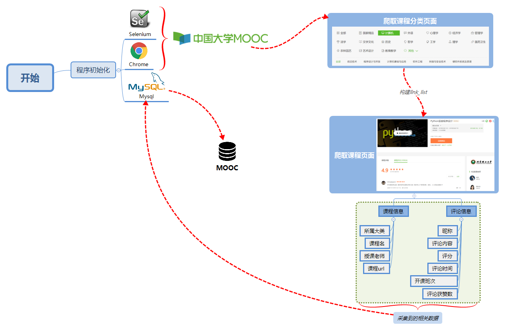
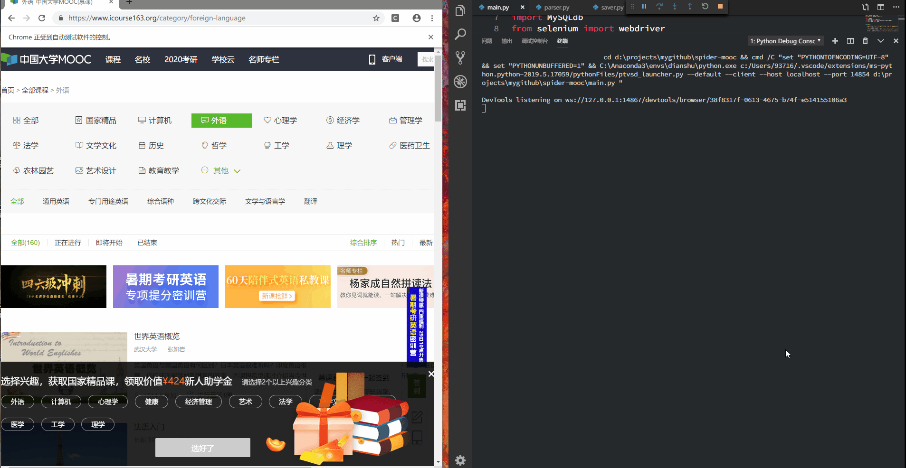

# spider-mooc🌈

> 中国大学MOOC网站课程信息以及课程评论的网络爬虫🤣🤣🤣。


## 项目介绍

利用**selenium**以及**chrome**来自动获取到中国大学MOOC课程分类下的所有课程URL，再进一步获取所有课程的具体信息以及课程评论。

- mian.py 为项目主程序，在初始化过程中需要填入`mysql`的相关配置信息
- utils 内为解析以及存储程序
- drivers 内为调用`Chrome`的驱动程序

## 环境要求

- [ ] 🐍Python3.5+
- [ ] Mysql
- [ ] Chrome
- [ ] Selenium

**Tips:**

使用Selenium需要根据当前Chrome的版本下载指定的驱动版本，本项目所使用的Chrome为74版。驱动下载地址为：<https://sites.google.com/a/chromium.org/chromedriver/>

## 安装以及运行
### 安装
```
git clone https://github.com/hy59/spider-mooc.git
```
### 运行
```
cd spider-mooc
python main.py
```
## 爬取流程



## 效果展示



## 其他

**本项目仅限于Python爬虫学习，请勿用于商业用途。**

**要是大家喜欢本项目，欢迎大家`fork`🍴🍴🍴和`star`⭐⭐⭐~**

**对该项目有任何意见或者建议也欢迎大家提`issue`🙋~**


